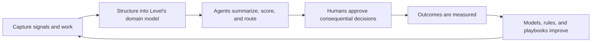

# Level Intelligence OS - ROI and Compounding Value Model

## Core Value Thesis

Level Intelligence OS creates value in three layers:

1. **Operational ROI:** fewer missed opportunities, less admin work, faster qualification, better bid discipline, fewer stalled decisions.
2. **Strategic ROI:** better market visibility, stronger relationship leverage, more selective pursuit, better cross-vertical coordination.
3. **Enterprise Value ROI:** Level creates a proprietary operating dataset and internal software layer that compounds as the company grows.

The most important point: the system is not merely a cost-saving automation tool. It is an enterprise asset that learns Level's business.

## Value Lever 1: Opportunity Capture

### Current Problem

Many opportunities are discovered late, informally, or inconsistently. Signals may appear in public records, planning agendas, broker conversations, franchise news, relationship chatter, emails, and RFQs. If no system captures and routes those signals, Level depends on individual memory and timing.

### System Mechanism

- Detect signals earlier.
- Convert them into opportunity records.
- Link them to accounts, sites, relationships, and markets.
- Score fit.
- Assign an internal owner.
- Track next action.

### Value Created

- More qualified opportunities enter the pipeline.
- Fewer promising signals are missed.
- Leadership sees emerging market activity.
- BD and preconstruction focus on higher-probability pursuits.
- Level builds a proprietary map of its opportunity universe.

### Measurement

- Number of signals captured per week.
- Percentage converted to opportunity.
- Percentage pursued.
- Win rate by signal type.
- Average time from signal to first action.
- Opportunity value by source.

## Value Lever 2: Pursuit Discipline

### Current Problem

Construction and development firms often spend too much time on low-fit opportunities and too little time on high-fit opportunities. Go/no-go decisions may be inconsistent, late, or based on incomplete context.

### System Mechanism

- Standardize qualification.
- Compare opportunities to Level's history.
- Draft pursue/watch/pass recommendations.
- Explain risk and fit.
- Record decision rationale.
- Track outcome.

### Value Created

- Fewer low-margin distractions.
- Better alignment between BD, precon, executives, and capital.
- Faster go/no-go decisions.
- More consistent pursuit criteria.
- Better learning from wins and losses.

### Measurement

- Time from opportunity creation to go/no-go.
- Percentage of opportunities with complete score.
- Pursuit-to-win ratio.
- Win rate by score band.
- Margin by source and asset class.
- Reasons for pass and loss.

## Value Lever 3: Administrative Load Reduction

### Current Problem

Teams spend time converting messy language into structured work: reading RFQs, summarizing emails, finding documents, checking deadlines, writing follow-ups, and chasing status updates.

### System Mechanism

Agents handle the first-pass cognitive work:

- summarize,
- extract,
- classify,
- compare,
- draft,
- route,
- and remind.

### Value Created

- Less time spent on status chasing.
- Faster response to RFQs and permit issues.
- Fewer dropped tasks.
- Better meeting preparation.
- Cleaner handoffs.
- Reduced dependency on individual memory.

### Measurement

- Hours saved per RFQ.
- Hours saved per weekly executive report.
- Hours saved per permit follow-up cycle.
- Reduction in manual status meetings.
- Reduction in overdue tasks.
- Reduction in missed deadlines.

## Value Lever 4: Bid And RFQ Quality

### Current Problem

RFQ work is deadline-driven, document-heavy, and often fragmented across email and folders. Teams may pursue bids without a complete understanding of requirements, risk, historical comps, or internal capacity.

### System Mechanism

- RFQ intake.
- Requirements extraction.
- Missing document detection.
- Bid checklist.
- Comparable prior project retrieval.
- Go/no-go memo.
- Bid status tracking.
- Win/loss outcome capture.

### Value Created

- Faster bid triage.
- Better selectivity.
- Fewer incomplete submissions.
- Better use of prior project knowledge.
- Better margin protection.
- Better post-bid learning.

### Measurement

- RFQs processed.
- Average RFQ review time.
- Percentage with go/no-go memo.
- Submission completeness.
- Win rate by RFQ type.
- Margin by bid type.
- Reasons for non-pursuit.

## Value Lever 5: Permit And Entitlement Risk Reduction

### Current Problem

Permit and entitlement delays often hide in email threads, portals, and jurisdiction-specific processes. Even when the team knows there is a delay, the reason and next action may not be visible to leadership.

### System Mechanism

- Track permit status.
- Parse comments and updates.
- Monitor days in review.
- Compare to expected cycle time.
- Draft follow-ups.
- Flag critical-path blockers.
- Maintain communication history.

### Value Created

- Earlier detection of delays.
- Faster response to comments.
- Better executive visibility.
- Less time searching for status.
- Better jurisdiction memory over time.

### Measurement

- Permits tracked.
- Average days in review.
- Permits past expected review time.
- Time from comment received to response.
- Number of follow-ups sent.
- Repeat issue categories by jurisdiction.

## Value Lever 6: Relationship Memory

### Current Problem

The most valuable relationship knowledge is often stored in people's heads. When someone is busy, traveling, or leaves the company, context weakens.

### System Mechanism

- Account timelines.
- Contact histories.
- Relationship owner tracking.
- Warm intro mapping.
- Last touch and next touch.
- Meeting and email summaries.
- Account brief generation.

### Value Created

- Better follow-through.
- Stronger relationship continuity.
- Faster onboarding of new team members.
- More effective outreach.
- Better leverage of Level's existing network.

### Measurement

- Accounts with complete relationship owner.
- Contacts with last touch date.
- Stale relationship count.
- Follow-up completion rate.
- Opportunities sourced by relationship.
- Win rate by relationship strength.

## Value Lever 7: Executive Focus

### Current Problem

Executives often get pulled into status gathering. The real value of leadership is judgment, not chasing scattered updates.

### System Mechanism

- Executive dashboard.
- Weekly brief.
- Pending decision queue.
- Exception reporting.
- Stalled opportunity alerts.
- Risk summaries.

### Value Created

- Leadership time shifts to decision-making.
- Fewer blind spots.
- Faster escalation.
- Better accountability.
- More consistent operating rhythm.

### Measurement

- Pending decisions by age.
- Stalled opportunities.
- Overdue RFQs.
- Overdue permit actions.
- Weekly brief usage.
- Executive dashboard adoption.

## Value Lever 8: Enterprise Data Asset

### Current Problem

Most companies generate valuable operating knowledge but do not retain it in reusable form.

### System Mechanism

Every activity becomes part of Level's private operating memory:

- signals,
- scores,
- decisions,
- relationships,
- RFQs,
- bids,
- permit timelines,
- vendor performance,
- win/loss outcomes,
- margin outcomes,
- and lessons learned.

### Value Created

- Proprietary dataset.
- Better recommendations.
- More consistent process.
- Reduced key-person dependency.
- Higher enterprise maturity.
- Potential future defensibility.

### Measurement

- Number of structured records.
- Completeness by object type.
- Recommendation accuracy.
- Human override rate.
- Search/retrieval usage.
- Outcomes tied back to prior decisions.

## Sample ROI Projection Framework

This is a placeholder model for discussion. It should be refined after discovery with Level's actual volumes, costs, win rates, margins, and software spend.

### Inputs To Collect

- Annual RFQ volume.
- Average hours spent per RFQ review.
- Average blended hourly cost of BD/precon/estimating.
- Annual opportunities reviewed.
- Current win rate.
- Average gross profit per won project.
- Number of missed or late opportunities.
- Current Procore or construction software spend.
- Executive hours spent in status meetings.
- Permit volume.
- Average delay cost or opportunity cost from permit issues.
- Number of active accounts/relationships.
- Current CRM/project management costs.

### Conservative Example Categories

| Category | Value Logic | Measurement |
|---|---|---|
| RFQ time saved | Fewer hours summarizing and checking packages | RFQs x hours saved x loaded cost |
| Better selectivity | Avoid low-fit pursuits | avoided pursuits x hours saved |
| Earlier opportunity capture | Win one additional qualified project | incremental gross profit |
| Permit delay reduction | Faster response to comments | days saved x carrying/coordination cost |
| Executive time saved | Fewer status-gathering meetings | hours saved x executive loaded cost |
| Software rationalization | Reduce unnecessary seats/modules over time | annual software cost reduction |
| Relationship follow-through | More repeat-owner opportunities | incremental revenue/gross profit |

### Illustrative Scenarios

These are not claims. They are scenario structures to populate after discovery.

#### Scenario A: Operational Efficiency Only

Value comes from administrative time savings and fewer missed deadlines.

Potential value drivers:

- RFQ review acceleration.
- Weekly reporting automation.
- Permit follow-up reduction.
- Executive status meeting reduction.
- Fewer dropped tasks.

#### Scenario B: One Better Opportunity

Value comes from identifying, qualifying, or winning one additional meaningful project that would otherwise be missed or pursued too late.

Potential value drivers:

- earlier signal detection,
- relationship-aware outreach,
- better go/no-go timing,
- faster bid readiness,
- stronger executive visibility.

#### Scenario C: Enterprise Operating Asset

Value comes from the system improving the quality and consistency of Level's decisions over time.

Potential value drivers:

- better scoring,
- reusable relationship memory,
- historical pattern recognition,
- onboarding leverage,
- strategic market intelligence,
- owned software optionality.

## Compounding Loop

The system should be explained as a loop:

## Why Compounding Matters

In year one, the system mainly improves visibility and workflow.

In year two, the system starts answering higher-value questions:

- Which asset classes produce the best fit?
- Which owners are highest value?
- Which signals most often become real projects?
- Which RFQs should we ignore?
- Which markets are heating up?
- Which jurisdictions require more lead time?
- Which vendors reduce risk?
- Which early indicators predict margin?

In year three, the system becomes part of Level's enterprise infrastructure:

- proprietary data,
- repeatable decision logic,
- cross-team operating memory,
- better onboarding,
- more durable processes,
- and software that evolves with strategy.

## What To Avoid

Avoid promising ROI only through labor savings. Labor savings are real, but they undersell the strategic value.

The larger value is:

- better opportunities,
- better decisions,
- less leakage,
- institutional memory,
- faster adaptation,
- and enterprise maturity.

## Related

- [[Level Intelligence OS - Strategic Dossier]]
- [[Level Intelligence OS - Agentic Architecture Blueprint]]
- [[Level Intelligence OS - Implementation and Discovery Plan]]
- [[Level Intelligence OS Buildout Plan]]

